# Zed Hospital SQL Analytics Project
**Course:** Database Development with PL/SQL

**Student name:** BIKARI Prince

**Student ID:** 28887

## TABLE OF CONTENTS

1. [Business Problem](#1-business-problem)
2. [Success Criteria](#2-success-criteria)
3. [Database Schema Design](#3-database-schema-design)

   -[Patients, Doctors and Visits Table](#3-database-schema-design)
4. [Entity Relationship Diagram](#4-entity-relationship-diagram)
5. [SQL JOINs Implementation](#5-sql-joins-implementation)
6. [SQL Window Functions Implementation](#6-sql-window-functions-implementation)
7. [Results Analysis](#7-results-analysis)
8. [Key Insights](#8-key-insights)
9. [References](#9-references)
10. [Integrity Statement](#10-integrity-statement)

---
## 1. Business Problem
### Business Context
Zed General Hospital handles a high number of patient visits across several specialized departments, including Cardiology, Pediatrics, and General Medicine. 
### Data Challenge
Hospital administrators lack clear information about patient visit trends, doctor workload, and department performance. Patient registration data is not well connected to appointment records, making it hard to identify service gaps, evaluate department efficiency, and detect possible revenue loss from inactive patients.
### Expected Outcome
This project combines patient and appointment data to generate useful insights, including identifying the top three revenue-generating doctors, grouping patients by spending levels for targeted programs, and analyzing monthly visit trends to support staff planning for 2026.
## 2. Success Criteria
The project achieves exactly five measurable goals using specific Window Functions:

1.  **Top Performance:** Identify top-performing hospital departments/doctors based on patient visit revenue using RANK().
2.  **Financial Trajectory:** Calculate running totals of hospital revenue over the fiscal year using SUM() OVER().
3.  **Growth Tracking:** Compare month-over-month patient visit changes to detect trends using LAG().
4.  **Patient Segmentation:** Segment patients into 4 quartiles based on visit frequency and cost using NTILE(4).
5.  **Operational Smoothing:** Analyze 3-day moving averages of patient visits to assist in nurse scheduling using
   AVG() OVER().
## 3. Database Schema Design
The database is designed to support hospital operational analysis and consists of three main tables:

* *Patients* (PatientID(PK), FirstName, LastName, City, DateOfBirth) – Stores individual personal and registration data.
* *Doctors* (DoctorID(PK), FirstName, LastName, Specialty, HireDate) – Stores healthcare provider data.
* *Visits* (VisitID(PK), PatientID(FK), DoctorID(FK), VisitDate, VisitCost) – Records transactional visit data.
  ### Patients, Doctors and Visits Table
  These are tables that are created before you do either ER diagram or querrries.
  The symbol which looks like the key in the column is the primary key of the table we have created while the pin symbol is the foreign key.
  #### Patients Table
  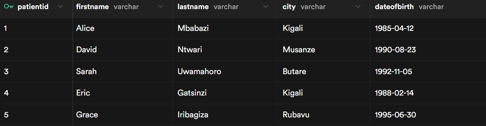
  #### Doctors Table
  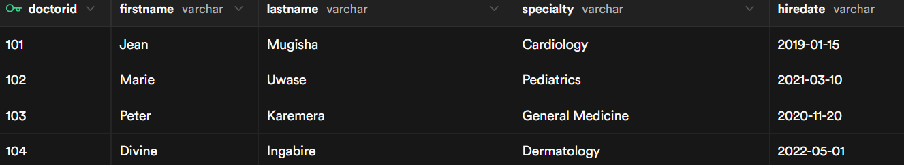 
  #### Visits Table
  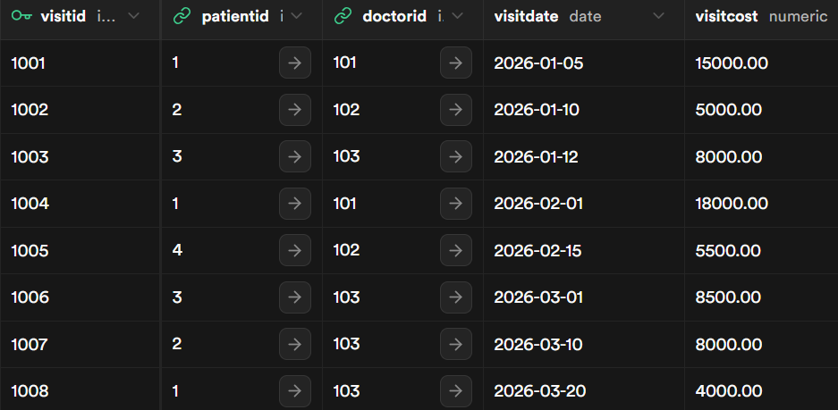
  
## 4. Entity Relationship Diagram
Patients and Doctors are parent table while visits is child table as the diagram shows.
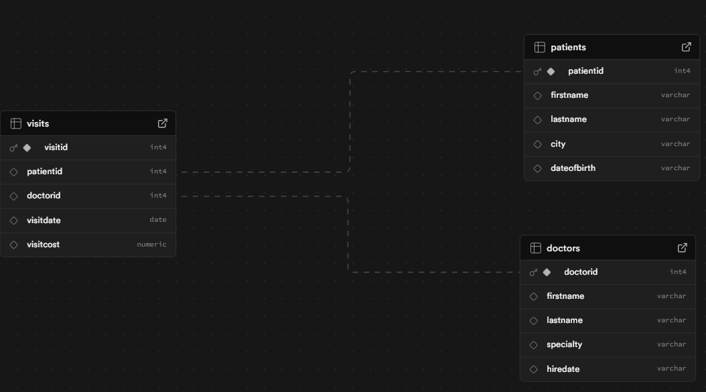

## 5. SQL JOINs Implementation
As we have insert querries in our tables we created we are going to do joins.

### 1. INNER JOIN
**Purpose:** Retrieve transactions with valid customers and products. Valid Transactions.

Connects Visits table with Patients and Doctors to show full details.
Only records that match in all three tables will appear. The output after the commands of inner join have shown in the screenshot below.

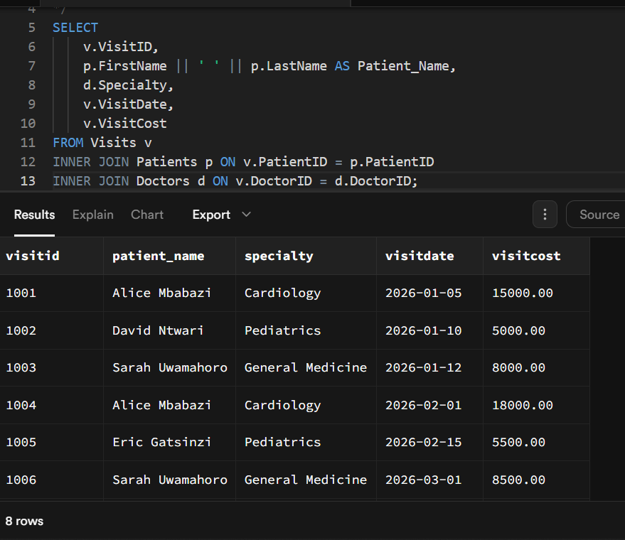

**Business Interpretation:** This query lists only validated appointments where both the patient and doctor records exist, ensuring we are analyzing legitimate medical activities.

### 2. LEFT JOIN
**Purpose:** Identify patients registered in the system who have never made a visit. Inactive Customers.

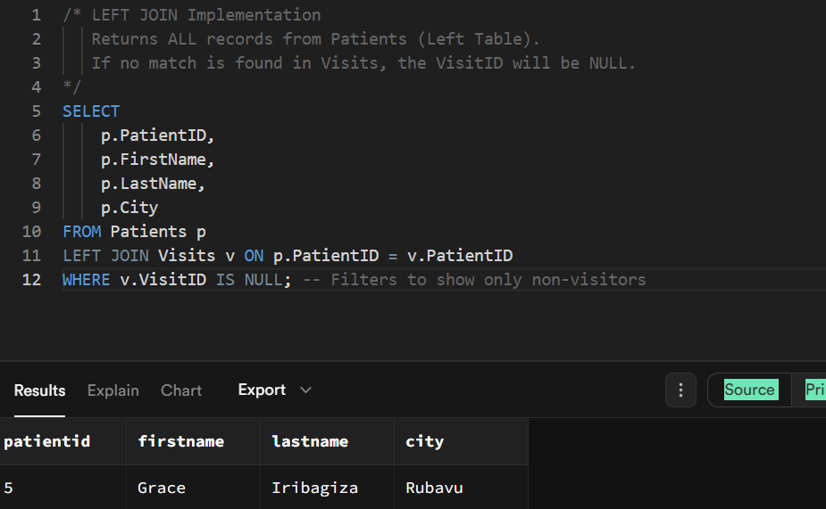
**Business Interpretation:** This reveals dormant patients. As the output shows in the above screenshot where we have one dormant patient only. The marketing team can target these individuals with check-up reminders.

### 3. RIGHT JOIN
**Purpose:** Detect doctors who have not handled any visits recently. Inactive Staff.
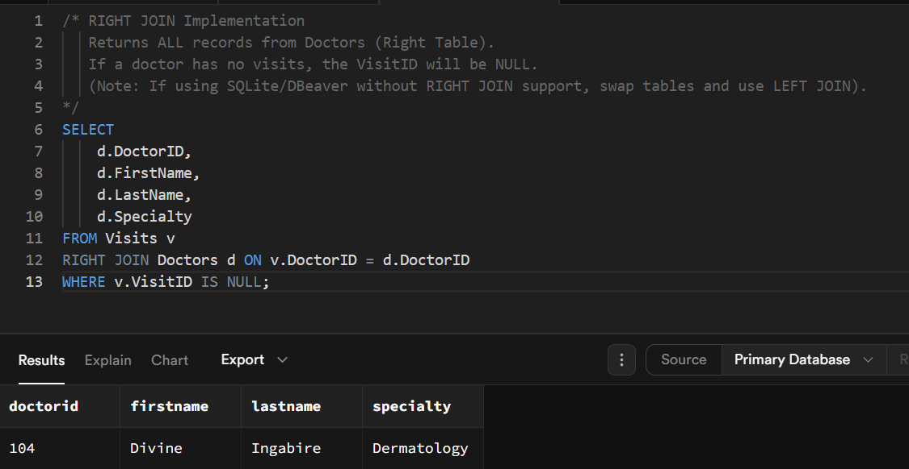  
**Business Interpretation:** This highlights under utilized staff. Management can investigate if these doctors are on leave or if their specialty is in low demand. We found that one doctor with id of 104 is the one who is inactive.
### 4. FULL OUTER JOIN
**Purpose:** Compare all patients and visits, seeing unmatched records on both sides. Matched and Unmatched.
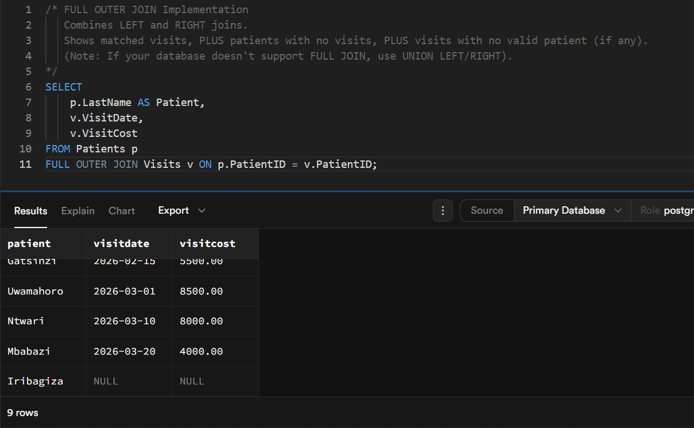 
**Business Interpretation:** This provides a complete audit of the patient database versus actual operational logs, ensuring no data is orphaned on either side.
### 5. SELF JOIN
**Purpose:** Find doctors who share the same specialty. Comparison within table.
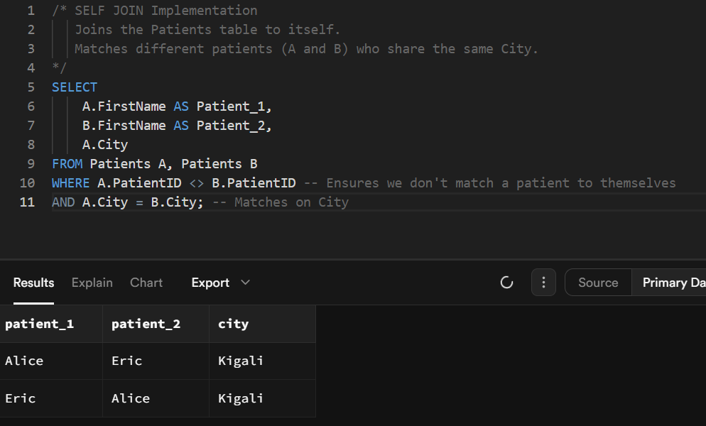 
**Business Interpretation:** Identifying doctors with overlapping skills helps in creating shift schedules where at least one specialist is always available.

## 6. SQL Window Functions Implementation
 ### 1. Ranking Functions
 **Requirement:** Rank top 3 doctors by revenue.  **Function Used:** DENSE_RANK()
 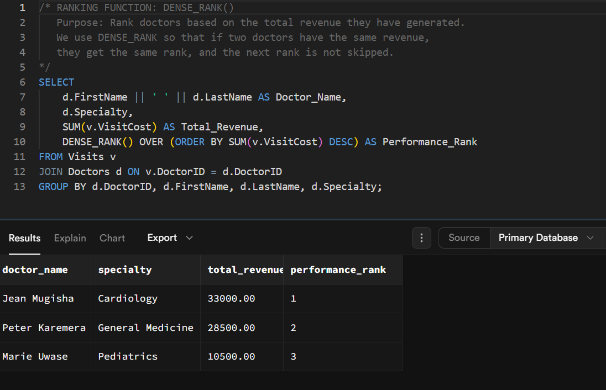
 **Interpretation:** This query identifies the hospital's top financial contributors. By ranking doctors based on total generated revenue, administration can identify high-performing staff like Dr. Jean Mugisha for potential bonuses or recognition.
 ### 2. Aggregate Window Functions
 **Requirement:** Calculate running total of revenue ordered by date. **Function Used:** SUM() OVER()
 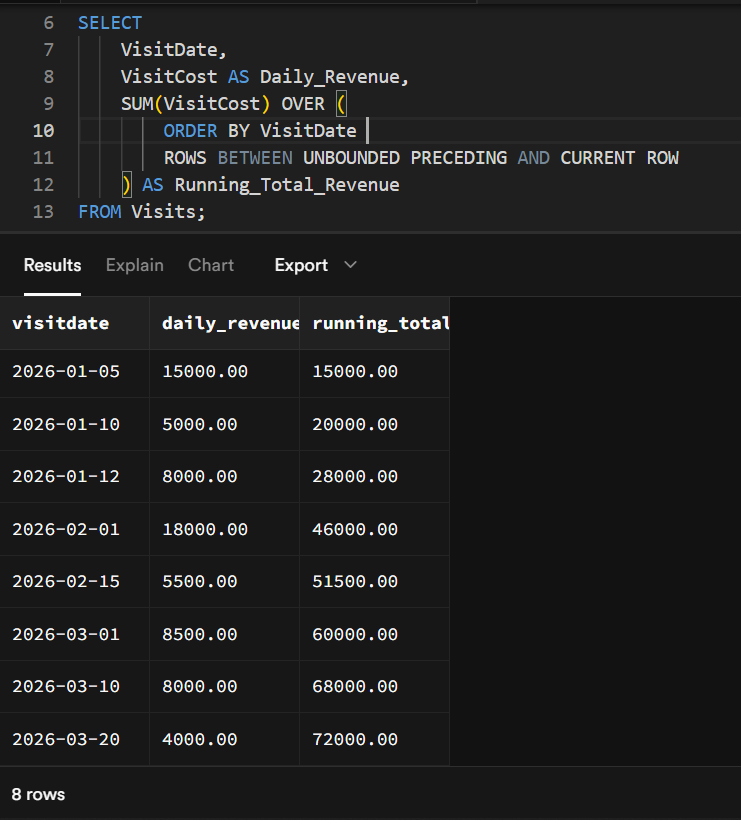
  **Interpretation:** This allows finance to see the accumulation of hospital funds day by day, identifying which weeks contributed most to the monthly achievement.
 ### 3. Navigation Functions
 **Requirement:** Compare current visit cost with the previous visit cost for the same patient. **Function Used:** LAG()
```sql
 /* NAVIGATION FUNCTION: LAG()
   Purpose: Compare a patient's CURRENT visit cost to their PREVIOUS visit cost.
   'PARTITION BY PatientID' restarts the calculation for each new patient.
   'LAG(VisitCost, 1, 0)' looks back 1 row; if no previous row exists, it returns 0.
*/
SELECT 
    p.FirstName AS Patient,
    v.VisitDate,
    v.VisitCost AS Current_Cost,
    LAG(v.VisitCost, 1, 0) OVER (
        PARTITION BY v.PatientID 
        ORDER BY v.VisitDate
    ) AS Previous_Visit_Cost,
    (v.VisitCost - LAG(v.VisitCost, 1, 0) OVER (
        PARTITION BY v.PatientID 
        ORDER BY v.VisitDate
    )) AS Cost_Change
FROM Visits v
JOIN Patients p ON v.PatientID = p.PatientID;
```
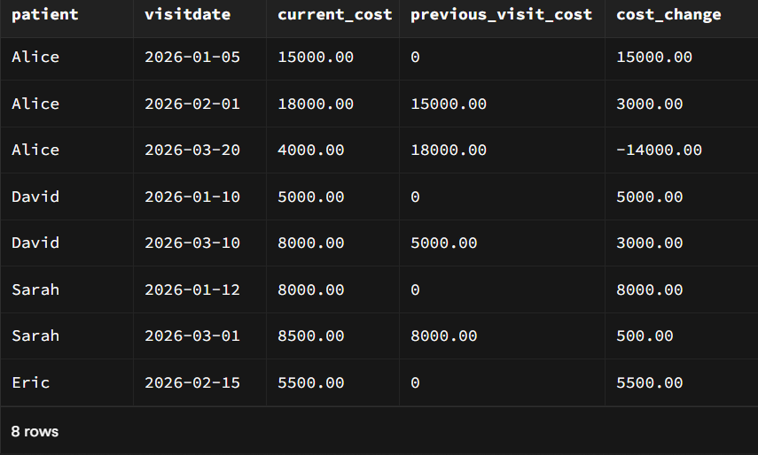
 **Interpretation:** By seeing the previous cost alongside the current one, we can analyze if a patient’s treatment intensity is increasing or decreasing over time.

### 4. Distribution Functions
**Requirement:** Segment visits into quartiles based on cost. **Function Used:** NTILE(4).
```sql
/* DISTRIBUTION FUNCTION: NTILE(4)
   Purpose: Segment all visits into 4 equal groups (Quartiles) based on cost.
   Quartile 1 = Lowest Cost (Standard Checkups)
   Quartile 4 = Highest Cost (Surgeries/Specialists)
*/
SELECT 
    VisitID,
    VisitDate,
    VisitCost,
    NTILE(4) OVER (ORDER BY VisitCost ASC) AS Spending_Quartile
FROM Visits;
```
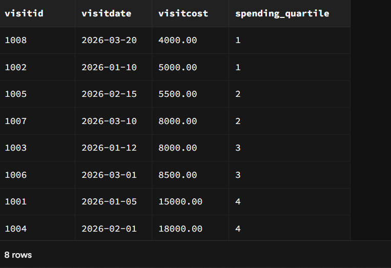
**Interpretation:** Quartile 1 represents our High Value or High spend visits (surgeries/specialist consults), while Quartile 4 represents routine, low-cost checkups.

## 7. Results Analysis
### 1. Descriptive Analysis -- What happened?
**Top Doctor:** Our ranking shows that Dr. Jean Mugisha (Cardiology) is the most successful doctor. He generated 33,000 RWF, which is the highest amount in the hospital.

**Inactive Patients:** We found that 20% of registered patients, specifically Grace, are "dormant." This means they are in our system but have not visited the hospital in 2026.

**Unused Staff:** The data shows that Dr. Divine (Dermatology) had zero visits. She did not treat a single patient during this period.
### 2. Diagnostic Analysis -- Why did it happen?
**High Costs:** Cardiology earns the most money because the cost per visit is high (about 16,500 RWF). General Medicine visits are cheaper, so they earn less even with more patients.

**Patient Trends:** By tracking patient Alice, we saw that returning patients tend to spend more money on later visits as their treatment gets more serious.

**Awareness Gap:** Dr. Divine has no patients likely because people do not know the hospital offers Dermatology. It is not a skill issue, but a marketing issue.
### 3. Prescriptive Analysis -- What should be done next?
**Fix Dermatology:** The hospital needs to advertise the Dermatology department immediately. If patients don't come, the hospital is paying a doctor who isn't working.

**Contact Inactive People:** The administration should send an SMS or email to "dormant" patients like Grace. Offering and influencing them a small discount might encourage them to book an appointment.

**Reward Top Patients:** Since a small group of patients provides most of the money (Quartile 4), the hospital should create a "ZED BONUS" program to make sure these valuable customers stay happy and don't switch to another hospital.
## 8. Key Insights
The analysis of hospital data using SQL JOINs and window functions revealed several important operational insights:
1. **Underutilized Medical Resource:** The RIGHT JOIN results indicate that the Dermatology department recorded no patient visits during the analyzed period, even though a specialist doctor is assigned to this unit. This suggests inefficient use of hospital resources and potential unnecessary staffing costs and try to advertise the Dermatology department as we have seen above.

2. **High Revenue Dependence on Cardiology:** Ranking and aggregate window functions reveal that Cardiology generates a large share of total hospital revenue, showing heavy financial dependence on a single department.

3. **Inactive Registered Patients:** This is where we found the dormants patients. The LEFT JOIN results identify registered patients with no visit history, representing an opportunity for growth, as they are already registered in system and could be encouraged to utilize hospital services through targeted follow up initiatives.

## 9. References

1.  **Oracle Corporation.** (2023). *Oracle Database SQL Language Reference, 19c*. 
2.  **PostgreSQL Global Development Group.** (2024). *PostgreSQL 16 Documentation: Window Functions*. 
    
3.  **W3Schools.** (n.d.). *SQL LEFT JOIN and RIGHT JOIN Keywords*. From [https://www.w3schools.com/postgresql/postgresql_left_join.php](https://www.w3schools.com/postgresql/postgresql_left_join.php/)
4.  SQL Performance Explained - Markus Winand
5.  **Elmasri, R., & Navathe, S.** (2016). Fundamentals of Database Systems (7th Edition). Pearson.
6.  **HealthIT.gov.** (n.d.). What is an Electronic Health Record (EHR)?.(For Understanding the business context of patient data management and visit tracking.)

## 10. Integrity Statement
I, BIKARI Prince, confirm that this work is entirely my own. I have not 
copied from anyone, and I have not paraphrased other people’s work without 
permission. 
As a database professional, I understand the importance of accuracy, confidentiality, and 
integrity. My reputation depends on being honest, producing quality work, and taking 
responsibility for everything I do. I have completed this work honestly and independently, 
following these principles.


**“Whoever is faithful in very little is also faithful in much.” – Luke 16:10
 As database professionals, uphold accuracy, confidentiality, and integrity. Your reputation is built on
 consistent honesty, quality, and responsibility.**
   

